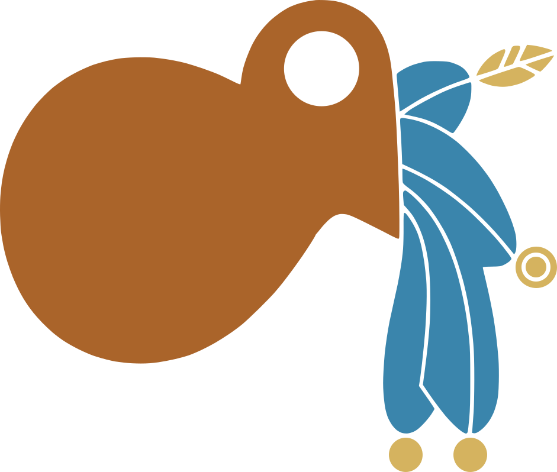
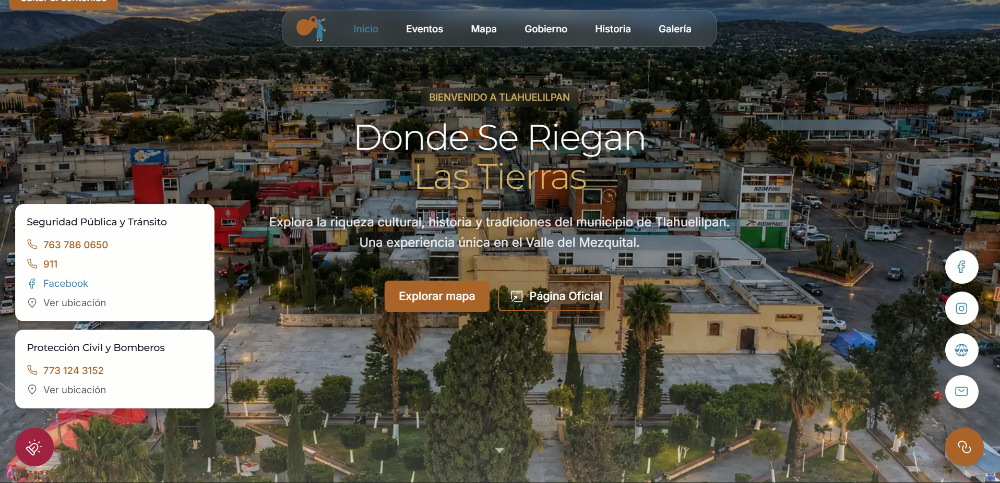

<div align="center">
    

# Tlahuelilpan - Portal Web

Portal digital del municipio de Tlahuelilpan, Hidalgo.

  
</div>

#

<p align="center" >
  <a href="https://skillicons.dev">
    
    
  </a>
  <br />
  
  
  
  
  
  
  

</p>

## 📋 Tabla de contenidos

- [Tlahuelilpan - Portal Web](#tlahuelilpan---portal-web)
- [](#)
  - [📋 Tabla de contenidos](#-tabla-de-contenidos)
  - [📖 Descripción](#-descripción)
  - [🛠️ Tecnologías](#️-tecnologías)
  - [✅ Requisitos previos](#-requisitos-previos)
  - [� Repositorios relacionados](#-repositorios-relacionados)
  - [🚀 Instalación](#-instalación)
  - [⚙️ Configuración](#️-configuración)
  - [💻 Uso](#-uso)
  - [📁 Estructura del Proyecto](#-estructura-del-proyecto)
  - [📄 Licencia](#-licencia)

---

## 📖 Descripción

**TlahueWeb** es el portal digital del municipio de Tlahuelilpan, Hidalgo. Una plataforma web moderna e interactiva que centraliza información municipal, eventos, galería multimedia, mapas 3D y directorio gubernamental, ofreciendo a la ciudadanía y visitantes una experiencia de navegación inmersiva y accesible.

- **Mapa Interactivo 3D**: Visualización del municipio con **Mapbox GL** y **Three.js**, incluyendo modelos GLTF de 7 monumentos históricos, límites territoriales y ciclos dinámicos de día/noche.
- **Galería Multimedia**: Exploración de imágenes con búsqueda por texto, filtrado por categorías, scroll infinito y lightbox con navegación por teclado.
- **Calendario de Eventos**: Visualización mensual de eventos cívicos y culturales con datos obtenidos en tiempo real desde la API.
- **Directorio Gubernamental**: Presentación interactiva del gabinete municipal con selector circular, datos de contacto y enlaces oficiales.
- **Línea de Tiempo Histórica**: Recorrido por la historia de Tlahuelilpan desde la época otomí hasta la actualidad, con animaciones _scroll-driven_ en desktop y carrusel táctil en móvil.
- **Diseño Responsivo**: Interfaz mobile-first construida con **Tailwind CSS 4**, accesible y optimizada para todos los dispositivos.
- **Optimización de Medios**: Entrega de imágenes optimizadas mediante **Cloudinary** en formato `.webp`.
- **Componentes Accesibles**: Navegación por teclado, _skip-to-content_, _focus trap_ en modales y atributos ARIA.

---

## 🛠️ Tecnologías

| Tecnología             | Propósito                                                      |
| ---------------------- | -------------------------------------------------------------- |
| **React 19**           | Biblioteca de interfaz de usuario                              |
| **TypeScript ~5.7**    | Tipado estático y seguridad en el código                       |
| **Vite 6**             | Build tool y dev server con HMR                                |
| **Tailwind CSS 4**     | Framework de estilos utilitario (configuración vía CSS)        |
| **React Router DOM 7** | Enrutamiento cliente (SPA)                                     |
| **Mapbox GL JS ~3.24** | Motor de mapas con estilo personalizado                        |
| **react-map-gl ~8.1**  | Bindings de Mapbox para React                                  |
| **Three.js ~0.184**    | Renderizado 3D con WebGL sobre el mapa                         |
| **GSAP ~3.15**         | Animaciones de alta performance (scroll-triggered)             |
| **Cloudinary**         | Alojamiento y optimización de imágenes                         |
| **ESLint 9**           | Linter con reglas para TypeScript, React Hooks y React Refresh |

---

## ✅ Requisitos previos

- Node.js
- pnpm
- Una cuenta en [Cloudinary](https://www.cloudinary.com)
- Una cuenta en [Mapbox](https://www.mapbox.com)

---

## 🔗 Repositorios relacionados

| Proyecto | Repositorio                                            | Live                                                        |
| -------- | ------------------------------------------------------ | ----------------------------------------------------------- |
| Back-End | [TlahueAPI](https://github.com/EricV29/tlahue-api.git) | [tlahue-api.onrender.com](https://tlahue-api.onrender.com/) |

---

## 🚀 Instalación

```bash
# 1. Clonar el repositorio
git clone https://github.com/EricV29/tlahue-web.git
cd tlahue-web

# 2. Instalar dependencias
pnpm install
```

---

## ⚙️ Configuración

Crea un archivo `.env` en la raíz del proyecto con tus credenciales:

```env
VITE_MAPBOX_TOKEN="pk.tu_token_aqui"
VITE_MAPBOX_STYLE="mapbox://styles/tu_usuario/tu_estilo"
VITE_API_URL="http://localhost:3000/api"
VITE_CLOUDINARY_CLOUD_NAME="tu_cloud_name"
```

---

## 💻 Uso

```bash
# Desarrollo
pnpm dev

# Typecheck + build
pnpm build

# Vista previa del build
pnpm preview
```

Accede a la app en `http://localhost:5173`.

---

## 📁 Estructura del Proyecto

```
src/
├── main.tsx                    # Punto de entrada (BrowserRouter + fuentes)
├── App.tsx                     # Componente raíz (rutas / y /galeria)
├── index.css                   # Tailwind 4 (@import + @theme)
├── vite-env.d.ts               # Tipos de Vite
│
├── assets/
│   ├── images/
│   │   ├── events/             # Imágenes de eventos (7)
│   │   ├── government/         # SVGs del gabinete (6)
│   │   └── history/            # Imágenes línea de tiempo (5)
│   ├── tlahuelilpanHero.png    # Banner README
│   ├── logo.svg                # Logotipo SVG
│   └── *.webp                  # assets generales
│
├── components/
│   ├── ErrorBoundary.tsx       # Captura de errores en React
│   ├── EventCard.tsx           # Tarjeta individual de evento
│   ├── Events.tsx              # Calendario de eventos mensual
│   ├── FloatingEmergency.tsx   # Botón flotante de emergencias
│   ├── FloatingPanel.tsx       # Panel flotante genérico
│   ├── FloatingSocial.tsx      # Botón flotante de redes sociales
│   ├── Footer.tsx              # Pie de página
│   ├── GalleryCard.tsx         # Tarjeta individual de galería
│   ├── GalleryLightbox.tsx     # Lightbox con navegación
│   ├── GalleryPage.tsx         # Galería completa con búsqueda y filtros
│   ├── Government.tsx          # Directorio de funcionarios
│   ├── Hero.tsx                # Hero section full-viewport
│   ├── History.tsx             # Línea de tiempo histórica
│   ├── MapTlahue.tsx           # Mapa 3D interactivo (Mapbox + Three.js)
│   ├── Navbar.tsx              # Barra de navegación responsiva
│   ├── ScrollToTop.tsx         # Scroll-to-top en cambio de ruta
│   ├── Skeleton.tsx            # Esqueletos de carga
│   ├── SkipToContent.tsx       # Enlace de salto al contenido
│   ├── icons/                  # Componentes SVG (21 iconos)
│   └── map/
│       ├── constants.ts        # Constantes del mapa (IDs, fuentes)
│       ├── createLabel3D.ts    # Etiquetas 3D con CSS2DRenderer
│       ├── createModelCard.ts  # Popups hover con Cloudinary
│       └── scene.ts            # Escena Three.js (luces, cámara, GLTF)
│
├── context/
│   └── LightboxContext.tsx     # Estado global del lightbox
│
├── data/
│   └── modelos3D.json          # Configuración de modelos 3D (7 puntos)
│
├── hooks/
│   ├── useFocusTrap.ts         # Focus trap para modales
│   └── useScroll.ts            # Hook de detección de scroll
│
├── services/
│   ├── api.ts                  # Wrapper base de fetch
│   ├── categories.service.ts   # API de categorías
│   ├── env.ts                  # Validación de variables de entorno
│   ├── events.service.ts       # API de eventos
│   ├── gallery.service.ts      # API de galería (paginada)
│   └── government.service.ts   # API de gobierno
│
└── utils/
    └── cloudinary.ts           # Constructor de URLs de Cloudinary
```

## 📄 Licencia

Este proyecto es de código abierto. Consulta el archivo `LICENSE` para más detalles.
